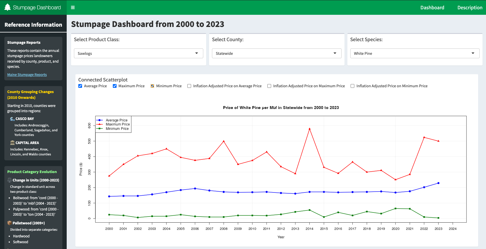
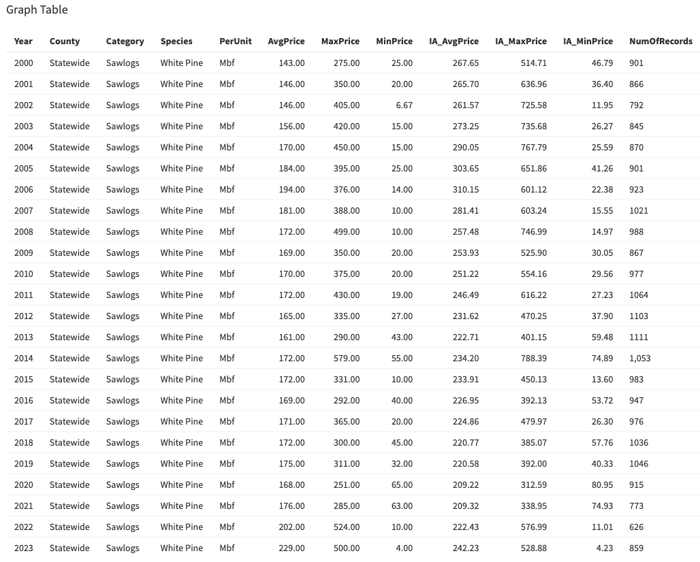

# Stumpage Dashboard from year 2000 to 2023

## Introduction
From 2000 to 2023, the Maine Department of Agriculture, Conservation and Forestry has compiled Annual Stumpage Reports—detailed snapshots of the state’s timber economy. Each report covers eight product classes—Biomass, Boltwood, Firewood, Palletwood, Pulpwood, Sawlogs, Studwood, and Veneer—broken down by county, with year-end summaries. For each class, it lists species-specific data, including average, minimum, and maximum prices, as well as the number of reports collected.

## Vision for Development

The Stumpage Dashboard represented a transformative leap, eliminating the time-consuming task of reviewing each year’s report to track price changes for any species across different counties. Built using R-shiny’s interactive framework, this comprehensive platform consolidates over two decades of stumpage pricing data (2000-2023). With the dashboard, users could seamlessly switch between different product classes and instantly view price trends based on their chosen county and tree species. Its dynamic visualization capabilities turned complex market data into clear, actionable insights—displaying average prices, inflation-adjusted values, and maximum and minimum price ranges through interactive time-series charts. The “Connected Scatterplot” unlocked relationships and market patterns that traditional tables could never reveal, while real-time filtering let stakeholders drill down into specific market segments in seconds. Beyond pricing, the tool also chronicled county-level grouping changes since 2010 and documented the industry’s shift from cord-based to ton-based measurements between 2004 and 2023, capturing not just the numbers but the very evolution of Maine’s timber markets.

## Coding Environment
The dashboard is totally developed in R-shiny environment. It uses reactive programming where in the outputs automatically updates when input changes. This environment requires thinking about user interaction flow, data reactivity, and web deployment simultaneously - quite different from writing regular R scripts!

#### Reactive chain: `Input → Reactive expressions → Outputs`

Here, the data is loaded outside the server and UI functions, allowing it to be shared across all sessions. This introduces a computational challenge—heavy operations within the server function increase program load, leading to sluggish performance. To mitigate this, the code limits calculations (particularly for *"inflation-adjusted price"*) to only the required value sets and employs flag variables to bypass unnecessary computations, and and one global variable which recurrently get's updated as per the applied filter thereby reducing processing overhead.

#### ⚠️Note: *The code relies solely on base R functions for both computation and visualization, minimizing processing time while keeping the implementation simple yet informative.*

Shiny applications run in a web browser, which means CSS and JavaScript can be integrated, though with certain limitations. By default, Shiny includes Bootstrap CSS, and custom styles or scripts can be added using tags$head(). While CSS generally integrates smoothly, custom JavaScript requires careful handling to ensure compatibility with Shiny’s reactive system.

## Graph Table

Below the connected scatter plot is the Graph Table, designed to provide a numeric representation of the visual data. Its main purpose is to offer quick and easy access to the underlying numbers for reference or analysis. The following is a description of each column in the table –

| Column Name             | Description                                                                                          |
|-------------------------|------------------------------------------------------------------------------------------------------|
| **Year**                | Year of the record, stored as a character.                                                          |
| **County**              | Selected county from the `SWCounty` input.                                                           |
| **Category**            | Product class selected from the `ProductClass` input.                                                |
| **Species**             | Species selected from the `Species` input.                                                           |
| **PerUnit**             | Unit of measurement for pricing (e.g., per ton, per cubic meter) from `update_table$PerUnit`.        |
| **AvgPrice**            | Average price from `update_table$AvgPrice`; shown only if `AvgPriceTag` is selected, otherwise `NA`. |
| **MaxPrice**            | Maximum price from `update_table$MaxPrice`; shown only if `MaxPriceTag` is selected, otherwise `NA`. |
| **MinPrice**            | Minimum price from `update_table$MinPrice`; shown only if `MinPriceTag` is selected, otherwise `NA`. |
| **IA_AvgPrice**         | Inflation-adjusted average price; shown only if `IAP_AvgPrice` is selected, otherwise `NA`.          |
| **IA_MaxPrice**         | Inflation-adjusted maximum price; shown only if `IAP_MaxPrice` is selected, otherwise `NA`.          |
| **IA_MinPrice**         | Inflation-adjusted minimum price; shown only if `IAP_MinPrice` is selected, otherwise `NA`.          |
| **NumOfRecords**        | Number of reports or records from `update_table$NumReports`.                                         |

## Conclusion
The Stumpage Dashboard integrates Maine’s historical forestry data with modern analytics to provide clear, standardized stumpage pricing. By consolidating and structuring market data, it enables landowners to perform accurate price comparisons, evaluate management options, and quantify the economic impact of conservation decisions. 

With modern tools like the Stumpage Dashboard, we can ensure they continue to provide economic, ecological, and social benefits for centuries to come. The dashboard isn't just about tracking timber prices – it's about sustaining the communities, ecosystems, and ways of life that depend on Maine's extraordinary forest legacy.